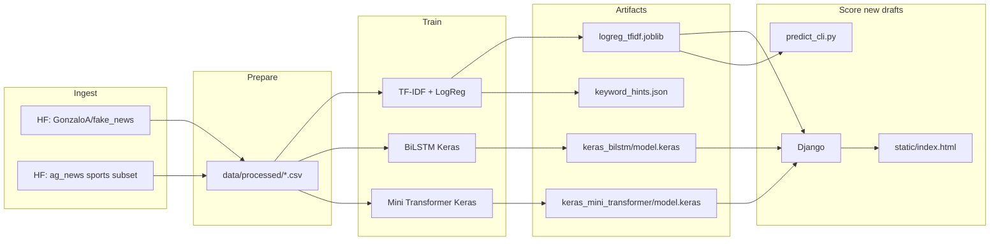

# Fake news detection prototype

[](LICENSE)
[](https://www.python.org/downloads/)
[](https://www.tensorflow.org/)
[](https://streamlit.io/)
[](https://github.com/akhilvydyula/fake-news-detection/stargazers)
[](#open-source)

**Step-by-step runbook (setup, train, UI, shortcuts):** [DOCUMENTATION.md](DOCUMENTATION.md) · **Product / automation / teaching narrative:** [PRODUCT_AUTOMATION.md](PRODUCT_AUTOMATION.md)

**Investor demo docs:** [DEMO_TODAY.md](DEMO_TODAY.md) · [INVESTOR_ONE_PAGER.md](INVESTOR_ONE_PAGER.md)

**Quick start without typing `python -m …`:** from the repo root run `run.bat setup`, then `run.bat train`, then `run.bat serve` (Windows). On Unix use `./scripts/run.sh` with the same subcommands.

End-to-end prototype for scoring **draft news text** before you publish it on your site: build a labeled dataset from **permissive public sources**, train **classical (TF–IDF + logistic regression)** and **TensorFlow/Keras** models (BiLSTM and a compact **multi-head attention** encoder), export **interpretable keyword hints**, and run a small CLI scorer.

Reference portal you mentioned for human reading: [BBC Sport](https://www.bbc.com/sport).

## Why this repo does not scrape BBC for training data

BBC’s `robots.txt` and terms explicitly disallow **systematic extraction**, **building datasets** from BBC content, and **using BBC content to train or fine-tune AI models** (including LLMs). To stay aligned with those rules, this project **does not** implement a BBC crawler for model training.

What to do instead:

- Use **licensed syndication** or **publisher APIs** where you have explicit permission.
- For research and prototyping, use **open datasets** (this repo pulls from [Hugging Face](https://huggingface.co/datasets/GonzaloA/fake_news) plus optional **AG News** sports rows for a sport-flavored “reliable” signal—not a substitute for your own editorial policy).

## Architecture



## Quickstart

From the project root:

```powershell
python -m venv .venv
.\.venv\Scripts\Activate.ps1
pip install -e ".[dev]"
```

(`pip install -r requirements.txt` still works; the line above is the modern **editable install** and includes **pytest + Invoke** for tasks.)

### One-command workflows (for teaching)

| Idea | What students learn | Command(s) |
|------|---------------------|------------|
| **PEP 621 / `pyproject.toml`** | Declaring dependencies in one standard file; `pip install -e .` | `pip install -e ".[dev]"` |
| **Invoke (`tasks.py`)** | Cross-platform task runners; same role as scripts, less shell pain on Windows | `invoke --list` then e.g. `invoke train`, `invoke serve`, `invoke lab` |
| **Make (`Makefile`)** | Classic build automation; maps to CI “jobs” | `make setup && make serve` for UI (no train); `make lab-train` only if retraining (needs `make` on PATH) |
| **Raw modules** | What actually runs under the hood | `python -m src.pipeline.run_train` |

**Invoke cheat-sheet** (after `pip install -e ".[dev]"`):

```powershell
invoke venv --dev          # create .venv + install project (optional bootstrap)
invoke train               # full train (downloads/builds data unless you add flags)
invoke train-quick         # smoke: --quick --skip-build
invoke train --mlflow      # log to ./mlruns
invoke serve               # API + UI at http://127.0.0.1:8000
invoke test
invoke mlflow-ui           # browse experiments (separate terminal)
invoke lab                 # train-quick then serve (blocks on server)
```

**Make** (Git Bash / WSL / macOS / Linux):

```bash
make setup && make serve
# UI only (venv already ready): make install && make serve
# Optional retrain later: make train   or   make lab-train
```

**Optional — `uv` (fast installer, advanced):** [Astral uv](https://github.com/astral-sh/uv) can create a venv and sync deps in one step: `uv venv && uv pip install -e ".[dev]"`. Teach it as “pip, but faster and reproducible.”

**Full pipeline (downloads data, builds ~10k rows by default, trains all models):**

```powershell
python -m src.pipeline.run_train
```

**Faster smoke test (smaller sample, 1 epoch per Keras model):**

```powershell
python -m src.pipeline.run_train --quick
```

**Score a draft (after training):**

```powershell
python -m src.pipeline.predict_cli --text-file .\my_article.txt --backend classical
```

`--backend` can be `classical`, `bilstm`, or `mini_transformer`.

## Web app (friendly UI + API)

After training, start the server from the **project root**:

```powershell
python manage.py runserver 127.0.0.1:8000
```

- **UI:** open [http://127.0.0.1:8000/](http://127.0.0.1:8000/) — plain-language results, a simple “toward review” meter, and phrase-level hints (classical model).
- **Teacher mode:** checkbox in the UI (or `teacher_mode: true` in JSON) surfaces **precision / recall / AUC** from `artifacts/metrics.json` when you have run training.
- **JSON API:** `POST /api/analyze` with body `{"title":"...","body":"...","backend":"classical","teacher_mode":false}`.

`GET /api/health` reports which model files are present.

## MLflow (experiment tracking)

Log parameters, metrics, and key artifacts for teaching or comparison:

```powershell
python -m src.pipeline.run_train --mlflow
```

Browse runs (default files under `./mlruns`):

```powershell
mlflow ui --backend-store-uri ./mlruns
```

Set `MLFLOW_TRACKING_URI` if you use a remote tracking server.

## Metrics file and overfitting

Training writes **`artifacts/metrics.json`**: classical **train / val / test** precision, recall, F1, ROC-AUC, plus a short **`overfitting_note`**.

- **Overfitting (rule of thumb):** train ROC-AUC much higher than validation → model may be memorizing training quirks; check `keyword_hints.json` for suspicious shortcuts (domains, boilerplate).
- **Underfitting:** both train and validation metrics are low → richer features, more data, or a stronger model may help.
- **ROC-AUC** is on a **0–1** scale (e.g. **0.99** means 99% AUC, not “19%”). Compare **validation vs test** AUC to see if the hold-out is stable.

## CI / CD and security scanning

**GitLab:** GitLab **ignores** `.github/workflows/`. Use [`.gitlab-ci.yml`](.gitlab-ci.yml) at the repo root. If no pipeline appears, see **[GITLAB.md](GITLAB.md)** (default branch, shared runners, `glab` vs `gitlab-runner`, local commands).

### GitHub

Workflows under [`.github/workflows/`](.github/workflows/) run on push and pull requests to `main` or `master`.

| Workflow | Purpose | GitLab analogy (conceptual) |
|----------|---------|-----------------------------|
| [`ci.yml`](.github/workflows/ci.yml) | **Test** (pytest + import smoke), **Bandit** SAST + JSON artifact, **pip-audit** dependency report + artifact | `test` job + `SAST` / `dependency_scanning` |
| [`codeql.yml`](.github/workflows/codeql.yml) | **CodeQL** semantic analysis (Python) | Advanced SAST / security scanning |
| [`dependabot.yml`](.github/dependabot.yml) | Weekly PRs to bump **pip** + **GitHub Actions** deps | Dependency bot / Renovate |

**Where to look when debugging**

- **Actions** tab → failed job → expand steps; Bandit prints file/line; pip-audit prints vulnerable packages.
- **Security** tab → **Code scanning** for **CodeQL** (enable for the repo). Bandit results: **`bandit-results`** workflow artifact (JSON).
- **pip-audit** uploads a **`pip-audit-results`** artifact (JSON) even when the job is non-blocking.

**Policy knobs**

- **Bandit:** configured in [`bandit.yaml`](bandit.yaml). Medium+ severity fails the `sast-bandit` job; tune skips there with care.
- **pip-audit:** the audit step uses `continue-on-error: true` by default so TensorFlow-heavy stacks do not block every class PR. To **block merges** on known CVEs, edit `ci.yml` and remove `continue-on-error: true` from the pip-audit step (and triage with `pip-audit --ignore-vuln …` only when justified).
- **Fork PRs:** Code scanning uploads may be restricted for untrusted forks; see [GitHub docs on code scanning and pull requests](https://docs.github.com/en/code-security/code-scanning/creating-an-advanced-setup-for-code-scanning/configuring-advanced-setup-for-code-scanning#considerations-for-private-repositories-and-forks).

Local parity:

```powershell
pytest -q
pip install "bandit[toml]" pip-audit
bandit -r src -c bandit.yaml
pip install -e ".[dev]"; pip-audit --desc off
```

## Notebooks (for class and debugging)

| Notebook | Purpose |
|----------|---------|
| [`notebooks/01_teaching_walkthrough.ipynb`](notebooks/01_teaching_walkthrough.ipynb) | Load data, run predictions, show per-article explanations |
| [`notebooks/02_metrics_and_overfitting.ipynb`](notebooks/02_metrics_and_overfitting.ipynb) | Read `metrics.json`, compare splits, discuss AUC |
| [`notebooks/03_automation_product_and_model_zoo.ipynb`](notebooks/03_automation_product_and_model_zoo.ipynb) | Unseen-data triage, model tiers (classical → LLM), exercises |

## Data and labels

- **`is_fake = 1`**: model treats the text as **unreliable / should review** at score ≥ 0.5.
- **`is_fake = 0`**: **likely reliable** relative to the training mixture (not a guarantee of ground truth in the real world).

Sources:

- [GonzaloA/fake_news](https://huggingface.co/datasets/GonzaloA/fake_news): binary `label` mapped so sensational or unreliable-style rows trend **fake** in this project.
- [ag_news](https://huggingface.co/datasets/ag_news): only **Sports** (`label == 1`) lines are added as extra **reliable**-leaning news text to nudge the domain toward sport headlines.

Outputs under `data/processed/`:

- `train.csv`, `val.csv`, `test.csv`, `labeled_news.csv`

## Models

| Track | Location | Role |
|--------|-----------|------|
| Classical baseline | `artifacts/classical/logreg_tfidf.joblib` | Fast, strong baseline; easy to explain |
| BiLSTM | `artifacts/keras_bilstm/model.keras` | Sequence model in pure Keras |
| Mini Transformer | `artifacts/keras_mini_transformer/model.keras` | Multi-head attention + FFN block |

**Pretrained transformers (optional next step):** Hugging Face hosts many `bert-base`, `distilroberta`, and domain-specific checkpoints. Your local `transformers` build may expose **PyTorch-first** APIs; for **TensorFlow** checkpoints, prefer `keras-hub` or TensorFlow Hub and wire the same `TextVectorization`/tokenizer strategy. Treat third-party weights as a **separate license and compliance** decision.

## Keywords and interpretability

### 1) Linear model (primary interpretability)

`artifacts/classical/keyword_hints.json` lists **n-grams with large logistic-regression weights** toward the fake vs real side. These are **dataset-specific cues** (e.g. certain clickbait or partisan sites in the training corpus), **not** universal laws of “fake news.” Use them to:

- sanity-check whether the model latched onto **toxic shortcuts** (domain names, layout words like “featured image”);
- drive **editorial rules** (e.g. flag posts heavy in unverified claims patterns you define separately).

### 2) Neural models

The BiLSTM and mini-transformer are **less transparent** by default. Practical options for deeper explanations:

- **Occlusion / leave-one-out**: mask sentences or paragraphs; watch probability shifts.
- **Integrated gradients** or **gradient × input** on the embedding layer (adds code; keep for high-stakes reviews).
- **LIME** on a surrogate TF–IDF model for a quick local explanation (install `lime` separately).

### 3) Operational interpretability

Log **scores, model version, and top TF–IDF terms** for each CMS draft. When a score fires, editors see **why the linear model fired**, even if the neural net is the one you ship.

## Wiring into your website

1. On **draft save**, POST `title + body` to your backend.
2. Backend loads `logreg_tfidf.joblib` (or Keras model) and returns `p_fake`.
3. If `p_fake >= threshold`, set workflow state to **needs review** and attach `keyword_hints`-style terms from the linear model.

Do **not** auto-delete or auto-publish purely from the model; use it as **decision support**.

## Project layout

- `src/data/build_dataset.py` — download + merge + split
- `src/models/classical.py` — TF–IDF + logistic regression + keyword export
- `src/models/keras_models.py` — BiLSTM + mini Transformer
- `src/pipeline/run_train.py` — orchestration
- `src/pipeline/predict_cli.py` — CLI scoring

## Open source

This repository is **open source** under the [MIT License](LICENSE). Stars, issues, and pull requests are welcome — they help others discover the project and improve it for the community.

### Project docs for contributors


### How you can help

- **Star** the repo if you find it useful — it helps visibility on GitHub Explore and search.
- **Open an issue** for bugs, ideas, or questions.
- **Submit a pull request** with a focused change and a clear description.
- **Share** the project with students, journalists, or teams building trust-and-safety tooling.


- Verify dataset and model licenses before production use.
- Disclose automated scoring to users or moderators where required.
- Periodically **audit** for demographic or partisan bias; retrain on data that matches **your** distribution.

## Next steps you might take

- Add **human review labels** from your CMS and fine-tune.
- Add **language detection** and per-language heads.
- Deploy the classical model behind a **Django** (or similar) service and cache vectorization for latency.

If you want, we can add a minimal API service and Docker packaging in a follow-up change.
